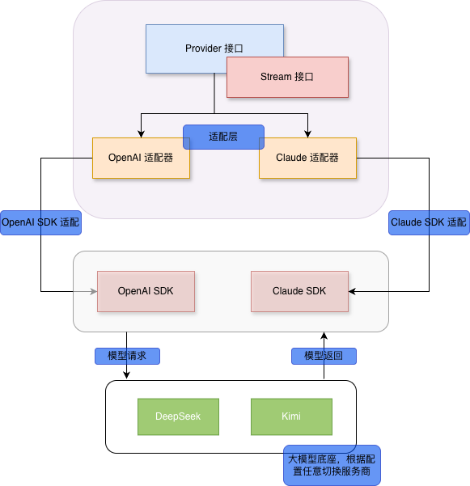

# 从零手搓 Harness 之 Provider 抽象，吃下 OpenAI / Anthropic 双协议

## 前言

这是从零开始搭建 Agent Harness（`go-harness`）的第二篇。Harness 类似给大模型套的那个"微型操作系统"：ReAct 循环、工具执行、上下文管理都在里面跑。走到接模型这一步会遇到很多坑，现在主流的协议就是 OpenAI 和 Anthropic，留意官方 SDK 的肯定知道这两者的差异还是挺大的。对于使用方来说，越简单使用越好，不必关注内部的细节。

这里用流式的方式，相较于同步的方式会复杂一些，但绝对是生产环境中最适用的一种。

完整代码参考 GitHub：[https://github.com/PycMono/go-harness](https://github.com/PycMono/go-harness)，本文涉及的所有文件（`pi/ai/`、`pi/ai/providers/`、`cmd/provider/`）都在仓库里可以直接翻。

## 流程图

下面是 Provider 设计的流程图，从图中可以看出整个设计和思路：

1. **大模型是底座**，可以根据配置任意切换模型服务商，目前是 `config.json` 配置，生产环境可以用配置中心替换，能动态切换模型；
2. **Provider 接口是 SDK 适配的标准接口**，`Stream` 接口是实现流式方案的接口；
3. **两个适配器**是为了适配不同的 SDK。



图里的「Claude 适配器」对应代码里的 `anthropic.go`；底座那一栏只是示意可切换的模型服务商，本文实测用的是 DeepSeek 和智谱。整个 Provider 层对上只暴露 `Provider` / `Stream` 两个接口，对下靠两个适配器消化各家 SDK 的差异。中间的翻译工作全部关在适配层里，两边互不可见。

## 代码实战

### 代码层级划分

所有 Provider 相关代码集中在两个目录，职责边界很清晰：`pi/ai` 是抽象层（只放接口和内部方言，不依赖任何 SDK 内部结构），`pi/ai/providers` 是适配层（每份协议一个文件，脏活全关在这里）。

```
pi/ai/
├── provider.go            # Provider / Stream 接口定义
├── event.go               # StreamEvent 事件模型
├── message.go             # 统一消息模型 + 双协议转换 + 入口校验
├── content.go             # 内容块联合类型（text / image）与校验
├── tool.go                # 统一 Tool Schema 与双协议转换
├── usage.go               # 归一化用量模型
└── providers/
    ├── options.go         # 平台配置：id / protocol / baseURL / apiKey / model
    ├── openai.go          # OpenAI 兼容协议适配器
    ├── anthropic.go       # Anthropic 协议适配器
    ├── stream.go          # 流式状态基座 + 失败流
    └── status_swap.go     # HTTP 状态码 → 统一错误码
```

分工对应流程图的三层：

| 层 | 职责 | 关键文件 |
|---|---|---|
| 抽象层 | 接口 + 内部消息方言，**对上稳定** | `provider.go` / `event.go` / `message.go` |
| 适配层 | 协议翻译 + 错误归一 + Usage 归一，**对下隔离** | `openai.go` / `anthropic.go` |
| 配置层 | 平台描述，换大脑 = 改配置 | `options.go` / `config.json` |

先看接口层，全部代码在 `pi/ai/provider.go` 和 `pi/ai/event.go`：

```go
package ai

import "context"

type Provider interface {
	Stream(context.Context, Messages, ToolDefinitions) Stream
}

// Stream 表示一次按顺序消费的模型响应流。
type Stream interface {
	Next() bool
	Current() StreamEvent
	Result() (*Message, error)
	Close() error
}
```

```go
package ai

type StreamEventType string

const (
	StreamEventStart     StreamEventType = "start"
	StreamEventTextDelta StreamEventType = "text_delta"
	StreamEventDone      StreamEventType = "done"
	StreamEventError     StreamEventType = "error"
)

// StreamEvent 是与具体模型 SDK 无关的模型响应事件。
type StreamEvent struct {
	Type      StreamEventType
	TextDelta string
}
```

这是标准的拉取式迭代器，和标准库 `sql.Rows` 的 `Next()/Scan()` 一脉相承：

- `Provider` 是工厂：拿这些输入去问模型，返回一个还没开始读的流；
- `Stream` 是游标：模型吐一个词，你就能处理一个词；
- `Result()` 在流耗尽后返回最终汇总，也就是完整的 assistant 消息、结束原因和 Token 用量。

流式相较于同步 `Generate` 会复杂一些（消费方要处理事件循环、错误要挪进流内），但换来的是打字机效果和"首个 chunk 到达"级别的首字延迟。

### 详细代码参考

#### 1. 统一消息模型与入口校验

内部方言定义在 `pi/ai/message.go`，与任何 SDK 无关：

```go
// Role 表示消息在大模型对话中的角色。
type Role string

const (
	RoleSystem    Role = "system"    // RoleSystem 表示系统提示词。
	RoleUser      Role = "user"      // RoleUser 表示用户输入。
	RoleAssistant Role = "assistant" // RoleAssistant 表示模型输出。
	RoleTool      Role = "tool"      // RoleTool 表示工具执行结果。
)

// FinishReason 表示模型结束当前响应的原因。
type FinishReason string

const (
	FinishReasonStop    FinishReason = "stop"
	FinishReasonToolUse FinishReason = "tool_use"
	FinishReasonLength  FinishReason = "length"
)

// Message 表示对话上下文中传递的一条消息。
type Message struct {
	// Role 表示消息角色。
	Role Role `json:"role"`
	// Content 保存消息的内容块。
	Content ContentBlocks `json:"content,omitempty"`
	// Usage 保存生成当前模型消息时产生的用量信息。
	Usage *Usage `json:"usage,omitempty"`
	// FinishReason 保存模型结束当前响应的统一原因。
	FinishReason FinishReason `json:"finish_reason,omitempty"`
	// ToolCalls 保存模型请求执行的工具调用，允许同时包含多个调用。
	ToolCalls ToolCalls `json:"tool_calls,omitempty"`
	// ToolCallID 保存当前工具结果所对应的工具调用 ID。
	ToolCallID string `json:"tool_call_id,omitempty"`
	// ToolName 保存当前工具结果所对应的工具名称。
	ToolName string `json:"tool_name,omitempty"`
	// IsError 表示当前工具结果是否为错误结果。
	IsError bool `json:"is_error,omitempty"`
}

type Messages []*Message
```

非法输入如果透传给 SDK，排查成本极高。校验集中在 `Messages.Validate()`：

```go
// Validate 校验整个消息序列：角色必须已知，tool 消息必须携带 ToolCallID，
// 内容块必须合法且只允许 user 消息携带图片。Provider 在入口边界统一调用，
// 非法输入在协议转换前拦截，避免落成平台侧的模糊错误。
func (m Messages) Validate() error {
	for _, message := range m {
		switch message.Role {
		case RoleSystem, RoleUser, RoleAssistant, RoleTool:
		default:
			return fmt.Errorf("unsupported message role %q", message.Role)
		}
		if message.Role == RoleTool && message.ToolCallID == "" {
			return fmt.Errorf("tool message requires tool_call_id")
		}
		if err := message.Content.ValidateForRole(message.Role); err != nil {
			return fmt.Errorf("message role %q: %w", message.Role, err)
		}
	}
	return nil
}
```

内容块的校验在 `pi/ai/content.go`：text 块不得携带 Image，image 块必须携带合法的 http/https URL，且只允许 user 消息带图。

#### 2. 正向翻译：system 要单独拎出来

OpenAI 协议把 system 当普通消息，Anthropic 协议要求 system 单独拎出来，所以 `ToAnthropicMessages` 返回两个值：

```go
func (m Messages) ToAnthropicMessages() ([]anthropicsdk.MessageParam, []anthropicsdk.TextBlockParam, error) {
	result := make([]anthropicsdk.MessageParam, 0, len(m))
	var system []anthropicsdk.TextBlockParam

	for _, message := range m {
		switch message.Role {
		case RoleSystem:
			text, err := message.Content.Text()
			if err != nil {
				return nil, nil, err
			}
			system = append(system, anthropicsdk.TextBlockParam{Text: text})
		case RoleUser:
			var blocks []anthropicsdk.ContentBlockParamUnion
			for _, block := range message.Content {
				switch block.Type {
				case ContentTypeText:
					blocks = append(blocks, anthropicsdk.NewTextBlock(block.Text))
				case ContentTypeImage:
					blocks = append(blocks, anthropicsdk.NewImageBlock(anthropicsdk.URLImageSourceParam{URL: block.Image.URL}))
				}
			}
			result = append(result, anthropicsdk.NewUserMessage(blocks...))
		case RoleTool:
			text, err := message.Content.Text()
			if err != nil {
				return nil, nil, err
			}
			result = append(result, anthropicsdk.NewUserMessage(
				anthropicsdk.NewToolResultBlock(message.ToolCallID, text, message.IsError),
			))
		case RoleAssistant:
			text, err := message.Content.Text()
			if err != nil {
				return nil, nil, err
			}
			var blocks []anthropicsdk.ContentBlockParamUnion
			if text != "" {
				blocks = append(blocks, anthropicsdk.NewTextBlock(text))
			}

			for _, toolCall := range message.ToolCalls {
				var input any
				if err = json.Unmarshal(toolCall.Arguments, &input); err != nil {
					return nil, nil, fmt.Errorf("tool call %q arguments: %w", toolCall.ID, err)
				}
				blocks = append(blocks, anthropicsdk.NewToolUseBlock(toolCall.ID, input, toolCall.Name))
			}
			result = append(result, anthropicsdk.NewAssistantMessage(blocks...))
		}
	}
	return result, system, nil
}
```

对照看同一个文件里 OpenAI 协议的翻译 `ToOpenAIMessages`：

```go
func (m Messages) ToOpenAIMessages() ([]openaisdk.ChatCompletionMessageParamUnion, error) {
	result := make([]openaisdk.ChatCompletionMessageParamUnion, 0, len(m))
	for _, message := range m {
		switch message.Role {
		case RoleSystem:
			text, err := message.Content.Text()
			if err != nil {
				return nil, err
			}
			result = append(result, openaisdk.SystemMessage(text))
		case RoleUser:
			user, err := message.toOpenAIUserMessage()
			if err != nil {
				return nil, err
			}
			result = append(result, user)
		case RoleTool:
			text, err := message.Content.Text()
			if err != nil {
				return nil, err
			}
			result = append(result, openaisdk.ToolMessage(text, message.ToolCallID))
		case RoleAssistant:
			text, err := message.Content.Text()
			if err != nil {
				return nil, err
			}
			assistant := openaisdk.ChatCompletionAssistantMessageParam{}
			if text != "" {
				assistant.Content = openaisdk.ChatCompletionAssistantMessageParamContentUnion{OfString: openaisdk.String(text)}
			}
			for _, toolCall := range message.ToolCalls {
				assistant.ToolCalls = append(assistant.ToolCalls, openaisdk.ChatCompletionMessageToolCallUnionParam{
					OfFunction: &openaisdk.ChatCompletionMessageFunctionToolCallParam{
						ID: toolCall.ID,
						Function: openaisdk.ChatCompletionMessageFunctionToolCallFunctionParam{
							Name: toolCall.Name, Arguments: string(toolCall.Arguments),
						},
					},
				})
			}
			result = append(result, openaisdk.ChatCompletionMessageParamUnion{OfAssistant: &assistant})
		}
	}
	return result, nil
}
```

两个容易踩的坑，都藏在上面这段代码里：

1. **历史消息里的 `ToolCalls` 必须原样放回**。模型要看到自己上一轮发起了什么调用，才能理解这一轮的 tool 结果在回答什么，这条逻辑链断了模型就开始胡言乱语。
2. **工具结果的挂法完全不同**：OpenAI 是独立消息 `openaisdk.ToolMessage(text, toolCallID)`，Anthropic 是塞进 user 消息的 `NewToolResultBlock`。

工具定义的转换在 `pi/ai/tool.go`，思路相同：`ToOpenAITools` / `ToAnthropicTools` 两份翻译。其中藏着一坨脏活，JSON Schema 用 `any` 承载，数字在 Go 侧的落地类型并不固定，所以先过一遍 `normalizeToolSchemaNumbers`，把 `json.Number` 统一成 `int64` / `float64`，再做协议翻译。这种脏活干一次就够，别散落到调用方。

#### 3. 流式基座与 OpenAI 适配器

两个适配器共享同一个状态基座：

```go
package providers

import "github.com/PycMono/go-harness/pi/ai"

type streamState struct {
	current  ai.StreamEvent
	started  bool
	terminal bool
	result   *ai.Message
	err      error
}

func (s *streamState) Current() ai.StreamEvent { return s.current }

func (s *streamState) Result() (*ai.Message, error) { return s.result, s.err }

type failedStream struct {
	streamState
}

func newFailedStream(err error) ai.Stream {
	return &failedStream{streamState: streamState{err: err}}
}

func (s *failedStream) Next() bool {
	if s.terminal {
		return false
	}
	if s.start() {
		return true
	}
	return s.fail(s.err)
}

func (s *failedStream) Close() error { return nil }
```

`failedStream` 在入口校验、协议转换失败时，返回一个"出生即报错"的流。上层消费方不需要单独处理同步错误，照常一套 `for stream.Next()` 消费到底就行。

基座只有这一份，两个适配器各自实现自己的 `Next()`。先看 OpenAI 侧：

```go
// pi/ai/providers/openai.go
package providers

import (
	"context"
	"encoding/json"
	"errors"
	"fmt"

	"github.com/PycMono/go-harness/pi/ai"
	pierrors "github.com/PycMono/go-harness/pi/error"
	openaisdk "github.com/openai/openai-go/v3"
	"github.com/openai/openai-go/v3/option"
	"github.com/openai/openai-go/v3/packages/respjson"
	openaisstream "github.com/openai/openai-go/v3/packages/ssestream"
)

type OpenAIImpl struct {
	client openaisdk.Client
	model  string
	name   string
}

func NewOpenAI(opts *Options) ai.Provider {
	return &OpenAIImpl{
		client: openaisdk.NewClient(
			option.WithAPIKey(opts.APIKey),
			option.WithBaseURL(opts.BaseURL),
			option.WithMaxRetries(0),
		),
		model: opts.Model,
		name:  opts.ID,
	}
}
```

构造函数里的 `option.WithMaxRetries(0)` 值得单独说：SDK 默认会自动重试，但**"什么错误值得重试"是 Harness 的策略问题**，不是 SDK 的机械行为，决策权要收回上层。

`Stream()` 入口，四步走：校验 → 转换 → 组参数 → 发流式请求：

```go
func (o *OpenAIImpl) Stream(
	ctx context.Context,
	msgs ai.Messages,
	tools ai.ToolDefinitions,
) ai.Stream {
	if err := msgs.Validate(); err != nil {
		return newFailedStream(pierrors.ErrAIGeneration.Wrap(fmt.Errorf("%s 消息校验失败: %w", o.name, err)))
	}

	openAIMessages, err := msgs.ToOpenAIMessages()
	if err != nil {
		return newFailedStream(pierrors.ErrAIGeneration.Wrap(fmt.Errorf("%s 消息转换失败: %w", o.name, err)))
	}

	openAITools, err := tools.ToOpenAITools()
	if err != nil {
		return newFailedStream(pierrors.ErrAIGeneration.Wrap(fmt.Errorf("%s 工具定义转换失败: %w", o.name, err)))
	}

	params := openaisdk.ChatCompletionNewParams{
		Model:         o.model,
		Messages:      openAIMessages,
		StreamOptions: openaisdk.ChatCompletionStreamOptionsParam{IncludeUsage: openaisdk.Bool(true)},
	}
	if len(openAITools) > 0 {
		params.Tools = openAITools
	}

	return &openAIStream{provider: o, stream: o.client.Chat.Completions.NewStreaming(ctx, params)}
}
```

注意 `IncludeUsage: true` 这个参数。OpenAI 兼容协议默认**流式请求不返回用量**，不显式打开的话 Usage 永远是空的。

流式循环，拉 chunk、累积、翻译成统一事件：

```go
type openAIStream struct {
	streamState
	provider    *OpenAIImpl
	stream      *openaisstream.Stream[openaisdk.ChatCompletionChunk]
	accumulator openaisdk.ChatCompletionAccumulator
	pending     []ai.StreamEvent
	usageSeen   bool
}

func (s *openAIStream) Next() bool {
	if len(s.pending) > 0 {
		s.current = s.pending[0]
		s.pending = s.pending[1:]
		return true
	}

	if s.terminal {
		return false
	}
	if s.start() {
		return true
	}
	if s.stream == nil {
		return s.fail(s.err)
	}

	for s.stream.Next() {
		chunk := s.stream.Current()
		if !s.accumulator.AddChunk(chunk) {
			return s.fail(pierrors.ErrAIGeneration.Wrap(errors.New("流式响应拼接失败")))
		}
		if chunk.JSON.Usage.Valid() && chunk.Usage.JSON.PromptTokens.Valid() &&
			chunk.Usage.JSON.CompletionTokens.Valid() {
			s.usageSeen = true
		}
		for _, choice := range chunk.Choices {
			if choice.Delta.Content != "" {
				s.pending = append(s.pending, ai.StreamEvent{
					Type: ai.StreamEventTextDelta, TextDelta: choice.Delta.Content,
				})
			}
		}

		if len(s.pending) > 0 {
			s.current = s.pending[0]
			s.pending = s.pending[1:]
			return true
		}
	}

	if err := s.stream.Err(); err != nil {
		return s.fail(s.provider.classifyError(err))
	}
	if err := s.finish(); err != nil {
		return s.fail(err)
	}
	
	return s.done()
}

func (s *openAIStream) Close() error {
	if s.stream == nil {
		return nil
	}
	
	return s.stream.Close()
}
```

流耗尽后 `finish()` 完成反向翻译，组装统一消息：

```go
func (s *openAIStream) finish() error {
	response := s.accumulator.ChatCompletion
	if len(response.Choices) == 0 {
		return pierrors.ErrAIGeneration.Wrap(fmt.Errorf("%s API 返回空 choices", s.provider.name))
	}

	message := response.Choices[0].Message
	result := &ai.Message{
		Role:         ai.RoleAssistant,
		FinishReason: openAIFinishReason(response.Choices[0].FinishReason),
	}
	if message.Content != "" {
		result.Content = []ai.ContentBlock{ai.TextBlock(message.Content)}
	}
	for _, toolCall := range message.ToolCalls {
		if toolCall.Type != "function" {
			continue
		}
		result.ToolCalls = append(result.ToolCalls, ai.ToolCall{
			ID:        toolCall.ID,
			Name:      toolCall.Function.Name,
			Arguments: json.RawMessage(toolCall.Function.Arguments),
		})
	}

	if s.usageSeen {
		result.Usage = mapOpenAIUsage(response.Usage)
	}
	s.result = result
	
	return nil
}
```

翻译后，上层拿到的永远是同一种东西：`FinishReason == tool_use` 且 `ToolCalls` 非空，就是模型要调工具；`FinishReason == stop` 且 `Content` 有文本，就是纯对话回复。

#### 4. Anthropic 协议适配器

```go
// pi/ai/providers/anthropic.go
package providers

import (
	"context"
	"encoding/json"
	"errors"
	"fmt"

	"github.com/PycMono/go-harness/pi/ai"
	pierrors "github.com/PycMono/go-harness/pi/error"
	anthropicsdk "github.com/anthropics/anthropic-sdk-go"
	"github.com/anthropics/anthropic-sdk-go/option"
	anthropicstream "github.com/anthropics/anthropic-sdk-go/packages/ssestream"
)

type AnthropicImpl struct {
	client anthropicsdk.Client
	model  string
	name   string
}

func NewAnthropic(opts *Options) ai.Provider {
	return &AnthropicImpl{
		client: anthropicsdk.NewClient(
			option.WithAPIKey(opts.APIKey),
			option.WithBaseURL(opts.BaseURL),
			option.WithMaxRetries(0),
		),
		model: opts.Model,
		name:  opts.ID,
	}
}

func (p *AnthropicImpl) Stream(
	ctx context.Context,
	msgs ai.Messages,
	availableTools ai.ToolDefinitions,
) ai.Stream {
	if err := msgs.Validate(); err != nil {
		return newFailedStream(pierrors.ErrAIGeneration.Wrap(fmt.Errorf("%s 消息校验失败: %w", p.name, err)))
	}

	messages, system, err := msgs.ToAnthropicMessages()
	if err != nil {
		return newFailedStream(pierrors.ErrAIGeneration.Wrap(fmt.Errorf("%s 消息转换失败: %w", p.name, err)))
	}
	tools, err := availableTools.ToAnthropicTools()
	if err != nil {
		return newFailedStream(pierrors.ErrAIGeneration.Wrap(fmt.Errorf("%s 工具定义转换失败: %w", p.name, err)))
	}

	params := anthropicsdk.MessageNewParams{
		Model:     p.model,
		MaxTokens: 4096,
		Messages:  messages,
		System:    system,
	}
	if len(tools) > 0 {
		params.Tools = tools
	}

	return &anthropicStream{provider: p, stream: p.client.Messages.NewStreaming(ctx, params)}
}
```

Anthropic 的流是事件联合类型，用 `Accumulate` 累积整条消息，只把文本增量翻译出去：

```go
type anthropicStream struct {
	streamState
	provider *AnthropicImpl
	stream   *anthropicstream.Stream[anthropicsdk.MessageStreamEventUnion]
	message  anthropicsdk.Message
}

func (s *anthropicStream) Next() bool {
	if s.terminal {
		return false
	}
	if s.start() {
		return true
	}
	if s.stream == nil {
		return s.fail(s.err)
	}

	for s.stream.Next() {
		event := s.stream.Current()
		if err := s.message.Accumulate(event); err != nil {
			return s.fail(pierrors.ErrAIGeneration.Wrap(err))
		}
		switch current := event.AsAny().(type) {
		case anthropicsdk.ContentBlockDeltaEvent:
			if delta, ok := current.Delta.AsAny().(anthropicsdk.TextDelta); ok && delta.Text != "" {
				s.current = ai.StreamEvent{Type: ai.StreamEventTextDelta, TextDelta: delta.Text}
				return true
			}
		case anthropicsdk.MessageStopEvent:
			if err := s.finish(); err != nil {
				return s.fail(err)
			}
			return s.done()
		}
	}

	if err := s.stream.Err(); err != nil {
		return s.fail(s.provider.classifyError(err))
	}
	if err := s.finish(); err != nil {
		return s.fail(err)
	}
	return s.done()
}
```

`finish()` 负责反向翻译和 Usage 口径归一。`stop_reason` 到统一 `FinishReason` 的映射，是照着 [stop reasons 文档](https://docs.claude.com/en/api/handling-stop-reasons) 里的取值写的：

```go
func (s *anthropicStream) finish() error {
	if s.message.StopReason == anthropicsdk.StopReasonModelContextWindowExceeded {
		return pierrors.ErrAIContextOverflow.Wrap(
			errors.New("model context window exceeded"),
		)
	}

	result := &ai.Message{Role: ai.RoleAssistant, FinishReason: anthropicFinishReason(s.message.StopReason)}
	for _, block := range s.message.Content {
		switch block.Type {
		case "text":
			result.Content = append(result.Content, ai.TextBlock(block.Text))
		case "tool_use":
			result.ToolCalls = append(result.ToolCalls, ai.ToolCall{
				ID:        block.ID,
				Name:      block.Name,
				Arguments: append(json.RawMessage(nil), block.Input...),
			})
		}
	}
	
	usage := s.message.Usage
	result.Usage = &ai.Usage{
		InputTokens:      usage.InputTokens + usage.CacheReadInputTokens + usage.CacheCreationInputTokens,
		OutputTokens:     usage.OutputTokens,
		CacheReadTokens:  usage.CacheReadInputTokens,
		CacheWriteTokens: usage.CacheCreationInputTokens,
	}
	s.result = result
	return nil
}
```

看 Usage 那几行——**这就是"最阴的差异"**：Anthropic 的 `input_tokens` 不含缓存命中的 token，OpenAI 的 `prompt_tokens` 却是总量，直接透传的话两个平台的"输入成本"根本不可比。所以我在适配层把缓存部分加总成统一口径，上层报表才能跨平台对齐。

OpenAI 侧对应的归一化还有非标字段的兼容：DeepSeek 的缓存命中走的是 `prompt_cache_hit_tokens`，协议外的私有字段，得经 SDK 的 ExtraFields 通道单独读出来解析：

```go
func mapOpenAIUsage(usage openaisdk.CompletionUsage) *ai.Usage {
	mapped := &ai.Usage{
		InputTokens:  usage.PromptTokens,
		OutputTokens: usage.CompletionTokens,
	}
	if usage.JSON.PromptTokensDetails.Valid() {
		mapped.CacheReadTokens = usage.PromptTokensDetails.CachedTokens
	}
	if usage.JSON.CompletionTokensDetails.Valid() {
		mapped.ReasoningTokens = usage.CompletionTokensDetails.ReasoningTokens
	}
	if hit := toInt64(usage.JSON.ExtraFields, "prompt_cache_hit_tokens"); hit > 0 {
		mapped.CacheReadTokens = hit
	}
	return mapped
}
```

两份代码都过完后，会发现两个适配器的 `Stream()` 方法干的其实是同一件事：不管 `OpenAIImpl` 还是 `AnthropicImpl`，方法体都是"组装 messages 和 tools，翻译成对应 SDK 的请求参数，发起流式请求"。步骤长得几乎一样：

| 流水线步骤 | OpenAIImpl | AnthropicImpl |
|---|---|---|
| 入口校验 | `msgs.Validate()` | 一模一样 |
| 翻译消息 | `msgs.ToOpenAIMessages()` | `msgs.ToAnthropicMessages()` |
| 翻译工具 | `tools.ToOpenAITools()` | `tools.ToAnthropicTools()` |
| 组装参数 | `ChatCompletionNewParams` | `MessageNewParams` |
| 发起流式请求 | `Chat.Completions.NewStreaming` | `Messages.NewStreaming` |

差异只在"翻译成谁的方言"。

#### 5. 对照着看：两份 Next() 差在哪

两家的流式底层走的是同一条路：SSE（Server-Sent Events）。响应头 `Content-Type: text/event-stream`，服务端把一次回复拆成一条条 event 顺着连接持续推过来。两个官方 SDK 都内置了 SSE 解析（[openai-go](https://pkg.go.dev/github.com/openai/openai-go/v3/packages/ssestream) / [anthropic-sdk-go](https://pkg.go.dev/github.com/anthropics/anthropic-sdk-go/packages/ssestream)，包路径都是 `packages/ssestream`），把字节流变成了带类型的迭代器：OpenAI 是 `Stream[ChatCompletionChunk]`，Anthropic 是 `Stream[MessageStreamEventUnion]`。

如果你把两份 `Next()` 摆在一起看，会发现 OpenAI 版开头多了一段：

```go
if len(s.pending) > 0 {
    s.current = s.pending[0]
    s.pending = s.pending[1:]
    return true
}
```

这不是代码风格问题，在于两家 SSE 事件的粒度不一样。

OpenAI 的 chunk 是"打包"来的：一个 chunk 里可能带好几段内容，而且 accumulator 必须把每一个 chunk 都吃进去，最终消息才拼得完整。处理一个 chunk 可能翻出多个 `text_delta`。但我们跟消费方的约定是"每次 `Next()` 只给一个事件"，多出来的总不能扔了吧？所以先塞进 `pending` 队列存着，下次 `Next()` 先还账、再拉新数据。这也是为什么这个 `if` 必须放在函数最前面——顺序一乱，缓冲的事件就丢了。

Anthropic 它的 SSE 事件本身就是细粒度的，一个 `content_block_delta` 事件正好对应我们要吐的一个 `text_delta`，一进一出，翻译是 1:1 的，用不着缓冲，就没有 `pending`。

两家在循环退出后的收尾倒是完全一致：`stream.Err()` 有错就走 `fail`（统一错误码），`finish()` 反向翻译、`done()` 收工。**OpenAI 的翻译是一进多出（1:N），Anthropic 是一进一出（1:1），`pending` 队列就是为 1:N 准备的缓冲区。**

#### 6. 错误也统一翻译

两个 SDK 的错误类型、错误字段名都不一样（OpenAI 看 `apiErr.Code`，Anthropic 看 `apiErr.Type()`），但翻译完都归到同一套错误码上：

```go
// providers/openai.go
func (p *OpenAIImpl) classifyError(err error) error {
	code := pierrors.ErrAIGeneration
	switch {
	case errors.Is(err, context.Canceled):
		code = pierrors.ErrCanceled
	case errors.Is(err, context.DeadlineExceeded):
		code = pierrors.ErrDeadlineExceeded
	}

	if apiErr, ok := errors.AsType[*openaisdk.Error](err); ok {
		switch {
		case apiErr.Code == "context_length_exceeded":
			code = pierrors.ErrAIContextOverflow
		case apiErr.Code == "insufficient_quota":
			code = pierrors.ErrAIQuotaExceeded
		default:
			code = HTTPStatusToCode(apiErr.StatusCode)
		}
	} else if IsTransientNetwork(err) {
		code = pierrors.ErrAITransient
	}

	return code.Wrap(err)
}
```

HTTP 状态码的兜底映射（`providers/status_swap.go`）：

```go
// HTTPStatusToCode 将 provider HTTP 状态码归入通用 AI 错误值。
func HTTPStatusToCode(status int) *errors.CodeError {
	switch {
	case status == http.StatusTooManyRequests:
		return errors.ErrAIRateLimited
	case status == http.StatusRequestTimeout,
		status == http.StatusConflict,
		status >= http.StatusInternalServerError:
		return errors.ErrAITransient
	case status == http.StatusUnauthorized,
		status == http.StatusForbidden:
		return errors.ErrAIUnauthorized
	case status == http.StatusBadRequest:
		return errors.ErrAIInvalidRequest
	default:
		return errors.ErrAIGeneration
	}
}
```

上层拿到的错误永远可分类、可做重试决策，不需要 `strings.Contains(err.Error(), "quota")` 这种判断。

#### 7. 配置驱动：换大脑 = 改配置

平台配置一个结构体搞定（`pi/ai/providers/options.go`）：

```go
type Protocol string

const (
	ProtocolOpenAI    Protocol = "openai"
	ProtocolAnthropic Protocol = "anthropic"
)

type Options struct {
	ID       string   `json:"id"`
	Protocol Protocol `json:"protocol"`
	BaseURL  string   `json:"baseURL"`
	APIKey   string   `json:"apiKey"`
	Model    string   `json:"model"`
}
```

```json
{
  "currentPlatform": "deepseek",
  "platforms": [
    {
      "id": "deepseek",
      "protocol": "openai",
      "baseURL": "https://api.deepseek.com/v1/",
      "apiKey": "你的 Key",
      "model": "deepseek-chat"
    },
    {
      "id": "zhipu-openai",
      "protocol": "openai",
      "baseURL": "https://open.bigmodel.cn/api/paas/v4/",
      "apiKey": "你的 Key",
      "model": "glm-4.5-air"
    },
    {
      "id": "zhipu-claude",
      "protocol": "anthropic",
      "baseURL": "https://open.bigmodel.cn/api/anthropic/",
      "apiKey": "你的 Key",
      "model": "glm-4.5-air"
    }
  ]
}
```

生产环境把这份配置换成配置中心拉取，就能做到动态切换模型服务商，Provider 层完全无感知。

工厂按 `protocol` 分发（`cmd/provider/main.go`）：

```go
func buildProvider(opts *providers.Options) ai.Provider {
	switch opts.Protocol {
	case providers.ProtocolOpenAI:
		return providers.NewOpenAI(opts)
	case providers.ProtocolAnthropic:
		return providers.NewAnthropic(opts)
	default:
		return nil
	}
}
```

#### 8. 消费方：一个循环走天下

接下来看看消费方怎么写，`cmd/provider` 是最小消费方，完整流式消费代码就一个函数：

```go
func consumeStream(stream ai.Stream) (*ai.Message, error) {
	defer stream.Close()

	for stream.Next() {
		event := stream.Current()
		switch event.Type {
		case ai.StreamEventStart:
			fmt.Println("[event] start")
		case ai.StreamEventTextDelta:
			fmt.Printf("[event] text_delta: %q\n", event.TextDelta)
		case ai.StreamEventDone:
			fmt.Println("[event] done")
		case ai.StreamEventError:
			fmt.Println("[event] error")
		}
	}
	return stream.Result()
}
```

主流程是读配置、选平台、建工厂，然后流式调用：

```go
opts := currentPlatform(&cfg)
provider := buildProvider(opts)

ctx, cancel := context.WithTimeout(context.Background(), 2*time.Minute)
defer cancel()

message, err := consumeStream(provider.Stream(ctx, ai.Messages{
	{Role: ai.RoleSystem, Content: ai.ContentBlocks{ai.TextBlock("你是一个简洁的测试助手。")}},
	{Role: ai.RoleUser, Content: ai.ContentBlocks{ai.TextBlock("用一句话介绍 Go 语言。")}},
}, nil))
```

真实运行输出：

```
=== deepseek (openai / deepseek-chat) 流式响应 ===
[event] start
[event] text_delta: "Go"
[event] text_delta: " "
[event] text_delta: "是"
...
[event] done
结果: role=assistant finish=stop text="Go 是一种由 Google 开发的静态类型、编译型编程语言…"
Usage: input=19 output=24 cache_read=0
```

把 `currentPlatform` 改成 anthropic 协议的平台，**上面这几十行消费代码一行不改**，事件序列、消息结构、Usage 语义完全一致。

## 总结

回到流程图的三层。对上：`Provider` 一个方法，`Stream` 四个方法，事件四种，消费方一个 `for Next()` 就能跑完整个流程；用拉取式迭代器替代同步 `Generate`，首字延迟变成首个 chunk 到达的时间。

消息、工具 Schema、错误、Usage 四类归一化全关在 `providers/` 里，Main Loop 只认识 `pi/ai` 的内部方言；非法输入在协议转换前被 `Messages.Validate()` 拦下，平台错误也出不了统一错误码（`classifyError`）。

中间那层只描述 `protocol + baseURL + model` 三元组，`config.json` 换成配置中心就能动态换模型，Provider 层无感知。

下一篇打算写 Harness 的执行循环，感兴趣的话关注一下，防止走丢。
